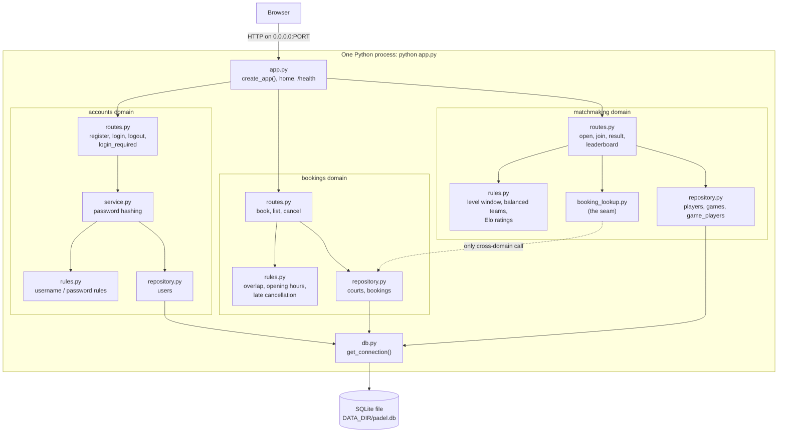
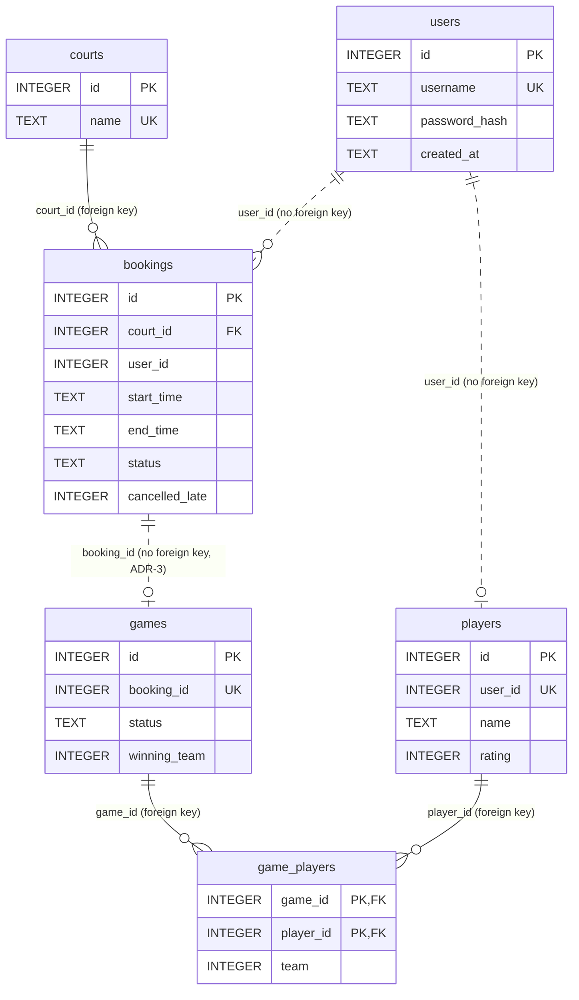

# Architecture

Padel Matchmaker is one Flask process (`python app.py`) with three feature domains. Each domain owns its own tables and has the same layers: `routes.py` (web pages), `rules.py` (pure business rules, no database), `repository.py` (SQL).

## Architecture overview

The dashed arrow is the seam between matchmaking and bookings: `matchmaking/booking_lookup.py` is the only file in matchmaking that reads bookings data. If the domains become separate services, only that file changes into HTTP calls (ADR-2).

## Database schema

Solid lines are real foreign keys, used only inside one domain. Dashed lines are links between domains, stored as plain INTEGER ids with no foreign key, so each domain's tables could later move to their own database (ADR-3).

| Domain | Tables |
|---|---|
| accounts | users |
| bookings | courts, bookings |
| matchmaking | players, games, game_players |
